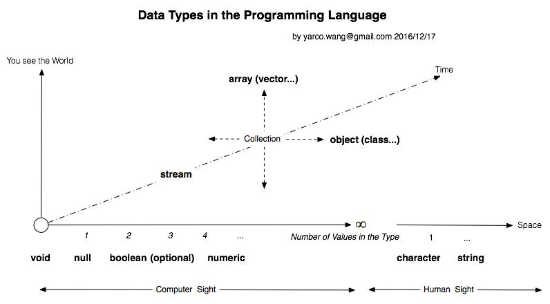

# Type System
This document records common types used in different cases for those who want to create compiling languages or scripting languages.

**Notice: it won't collect all types, but the most common parts.**
* Basic
* Collections 

## Blueprint

## Basic
<table>
  <thead>
    <tr>
      <th>Category</th><th>Type</th><th>Description</th><th>SQL Std. / Ext.</th><th>HTML5</th><th>C[1] / C++</th><th>Rust</th><th>PHP / Doctrine</th>
    </tr>
  </thead>
  <tbody>
    <tr>
      <th rowspan="5">Integer</th><td>bool</td><td>0, 1 or True, False, or Yes, No</td><td>Bit</td><td>boolean</td><td>_Bool (c99) / bool</td><td>bool</td><td>bool</td>
    </tr>
    <tr>
      <td>tinyint</td><td>0~255</td><td>Tinyint</td><td rowspan="4">range, number</td><td>&nbsp;</td><td>i8,u8</td><td rowspan="4">int / smallint, integer, bigint</td>
    </tr>
    <tr>
      <td>smallint</td><td>-215~215</td><td>Smallint</td><td>short, int</td><td>i16,u16</td>
    </tr>
    <tr>
      <td>int</td><td>-231~231</td><td>Int</td><td>long</td><td>i32,u32</td>
    </tr>
    <tr>
      <td>bigint</td><td>-264~264</td><td>/ Bigint</td><td>long long</td><td>i64,u64</td>
    </tr>
    <tr>
      <th rowspan="2">Float</th><td>float</td><td>mantissa >= 7</td><td>Real</td><td></td><td>float</td><td>f32</td><td></td>
    </tr>
    <tr>
      <td>double</td><td>mantissa >= 15</td><td>Double, Float</td><td></td><td>double</td><td>f64</td><td>float, double, real / float</td>
    </tr>
    <tr>
      <th>Decimal / Numeric</th><td>decimal</td><td>-1038~1038</td><td>Decimal</td><td></td><td></td><td></td><td> / decimal</td>
    </tr>
    <tr>
      <th rowspan="3">Text</th><td>char</td><td>fixed length</td><td>Char</td><td></td><td>char[]</td><td>&str</td><td></td>
    </tr>
    <tr>
      <td>varchar</td><td></td><td>Varchar</td><td>text</td><td rowspan="2">char* / string</td><td rowspan="2">String</td><td rowspan="2">string / string, text</td>
    </tr>
    <tr>
      <td>text</td><td></td><td>Text</td><td>textarea</td>
    </tr>
    <tr>
      <th rowspan="2">Binary</th><td>binary</td><td></td><td>Binary</td><td></td><td rowspan="2">void*</td><td></td><td> / binary</td>
    </tr>
    <tr>
      <td>image</td><td></td><td>Image</td><td>file</td><td></td><td> / blob</td>
    </tr>
    <tr>
      <th rowspan="3">Datetime</th><td>time</td><td></td><td>Time</td><td>time</td><td></td><td></td><td> / time</td>
    </tr>
    <tr>
      <td>date</td><td></td><td>Date</td><td>date</td><td></td><td></td><td> / date</td>
    </tr>
    <tr>
      <td>datetime</td><td></td><td>Datetime</td><td>datetime</td><td></td><td></td><td>Datetime / datetime</td>
    </tr>
  </tbody>
</table>

* [1] [Wikipedia](https://en.wikipedia.org/wiki/C_data_types)